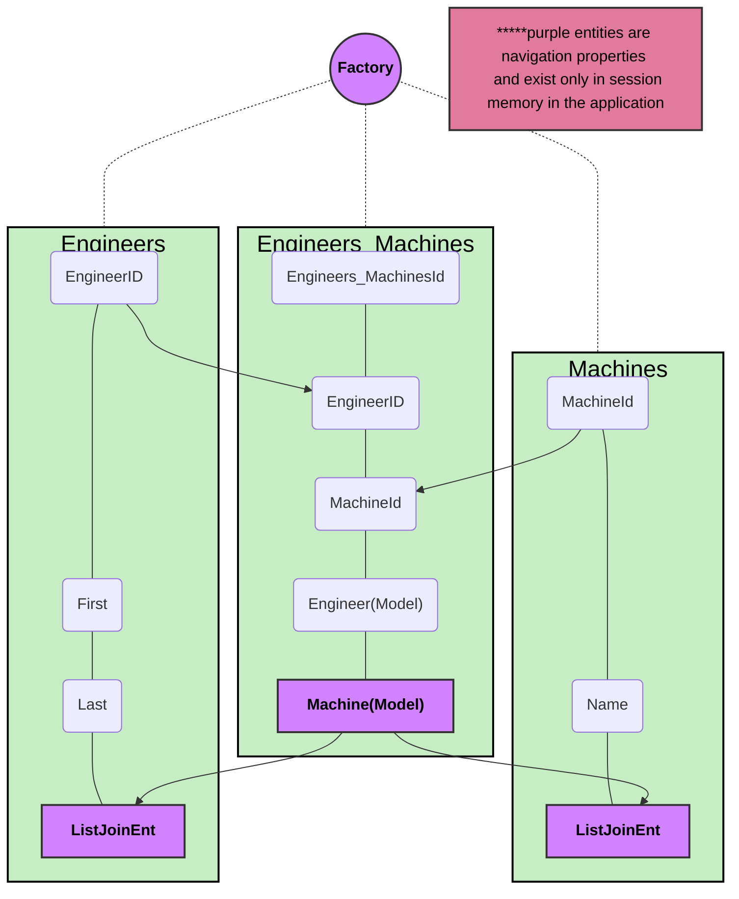

# [sillystrinzFactory](https://github.com/johnedisc/sillystringz_factory)

#### by [johnedisc](https://johnedisc.github.io/portfolio/)

#### an excercise in making a simple ASP.NET MVC website incorporating a database with Entity Framework



## technologies used

* C#
* ASP.NET 6
* entity framework
* Microsoft Identity for authentication and authorization
* mysql
* neovim text editor
* netcoredbg, samsung's open source dotnet debugger

## description

* this is an epicodus weekly project in the C# and .NET framework section of the course. it required making multiple classes and multiple controllers to route the content to different views with both attribute routing and html helpers. the site also employees many-to-many entities with the entity core framework object relational database.
* the styling is accomplished using shared views to allow passing html snippets to different parts of the website and incorporates a simple css stylesheet


## setup/installation requirements

* open a terminal on your machine
* clone down the [repository from github](https://github.com/johnedisc/sillystringz_factory) inside the directory of your choosing
```bash
git clone https://github.com/johnedisc/sillystringz_factory
```
* move into the project directory (Factory/)
```bash
cd sillystringz_factory.Solution/Factory
```
* create appsettings.json file here. first edit [yourDatabaseName], [mysqlIdName], [yourPassword] to your own settings
```bash
printf '{
  "ConnectionStrings": {
    "DefaultConnection": "Server=localhost;Port=3306;database=[yourDatabaseName];uid=[mysqlIdName];pwd=[yourPassword];"
  }
}' > appsettings.json
```
* make sure to turn on your mysql server client. this varies with OS. For Ubuntu for example it is the following:
```bash
sudo service mysql start
```
* run the project
```bash
dotnet run watch
```

## known Bugs

* no known bugs. layout is a work in progress.

## license

feel free to get in touch at [christopher(dot)johnedis(at)gmail(dot)com](christopher.johnedis@gmail.com)

MIT License

Copyright (c) [2023] [christopher johnedis]

Permission is hereby granted, free of charge, to any person obtaining a copy
of this software and associated documentation files (the "Software"), to deal
in the Software without restriction, including without limitation the rights
to use, copy, modify, merge, publish, distribute, sublicense, and/or sell
copies of the Software, and to permit persons to whom the Software is
furnished to do so, subject to the following conditions:

The above copyright notice and this permission notice shall be included in all
copies or substantial portions of the Software.

THE SOFTWARE IS PROVIDED "AS IS", WITHOUT WARRANTY OF ANY KIND, EXPRESS OR
IMPLIED, INCLUDING BUT NOT LIMITED TO THE WARRANTIES OF MERCHANTABILITY,
FITNESS FOR A PARTICULAR PURPOSE AND NONINFRINGEMENT. IN NO EVENT SHALL THE
AUTHORS OR COPYRIGHT HOLDERS BE LIABLE FOR ANY CLAIM, DAMAGES OR OTHER
LIABILITY, WHETHER IN AN ACTION OF CONTRACT, TORT OR OTHERWISE, ARISING FROM,
OUT OF OR IN CONNECTION WITH THE SOFTWARE OR THE USE OR OTHER DEALINGS IN THE
SOFTWARE.

